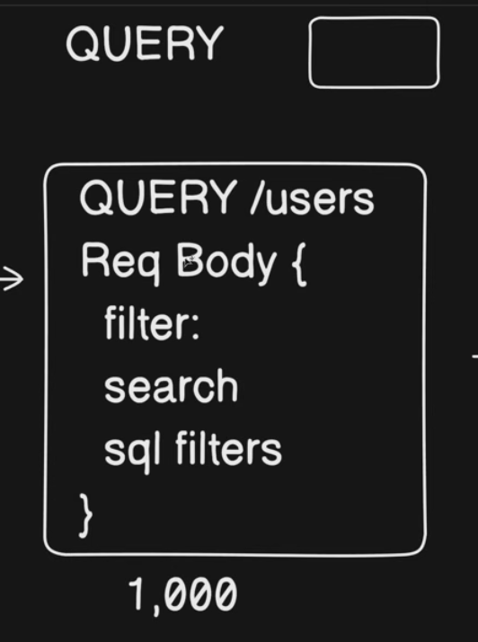
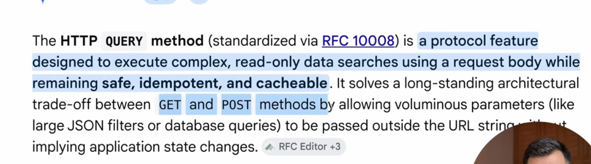

## HTTP Methods 
HTTP Standardization

Caching Mechanism:-

For now CDN can cache, but we can't cache POST.

Idempotent:-

- GET (YES) API calls are Indempotent, meaning If I do get call 5 times will get same resumt 5 times

- POST (X)API call are not Idempotent, meaning if we do post call even with the same name it will create 5 rows, with different ID.
- PATCH (X)
- DELETE (X)

--------------Problems with Get Query-----------------
- Some times the get calls are very complex

- So far the developers are resolving this issue in a hacky way. i.e POST
- In POST call we are getting the data but sending all the filter and parameters in the REQUEST BODY.
- 

 (BACK-END)

These are hacky ways + anti pattern from REST API + We can't cache the result as the POST APIS are not Idempotant.

- So now If I call 10,000 times this get call, then I can't use the cache result, it will always going to get it from DB.

## HTTP QUERY METHOD

- Intention is clear i.e QUERY
- We can add caching for QUERY as this would be idempotant
- Also we can send the parametrs in Req.BODY, (Which is Perfect)

Resorces :-

https://www.youtube.com/watch?v=Gdqkp-2V8KY

