# WebSockets vs Polling vs Server Sent Events

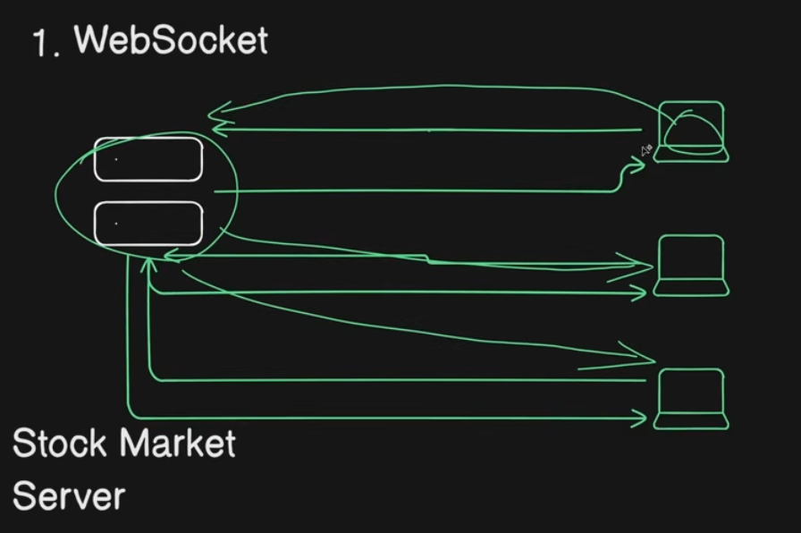
Here the connections are duplex in nature. 

- client 1 added new stock value in its account then
    - after updateing in the server, it will send the updated value to all the clients.

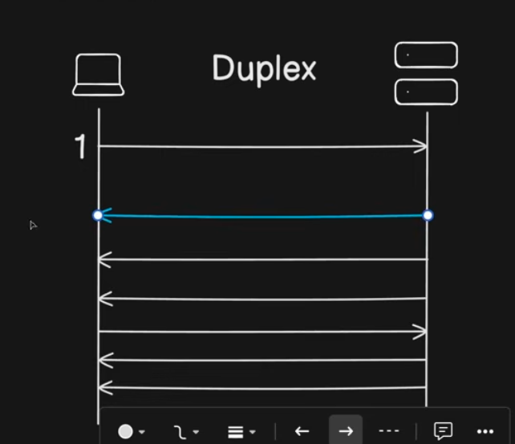

## Challenges with Websocket
- As this websocket is statefull service, server has limitation, meaning let's say max it can handle 1 Million duplex connections.
- But your user base increased to 2 Million, So you can only do Vertical scaling
- There are lots of challenges in the Horizontal scaling  

To Mitigate the Issue of Horizonatal Scalling:-

## Polling
will contineously ask server

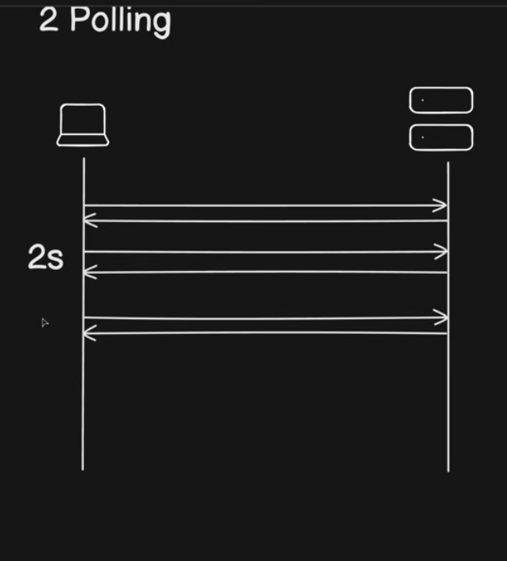

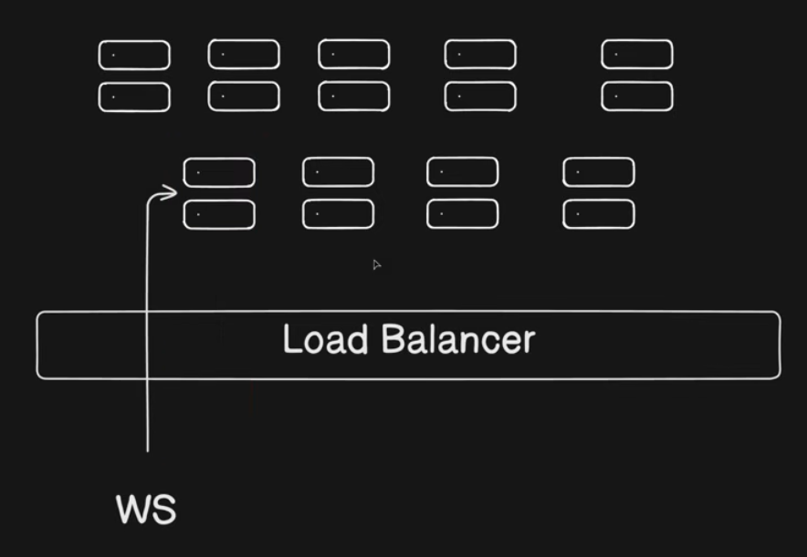

    - in websocket it set a connection and stay there, if server destroy we will get some error as connection breaks

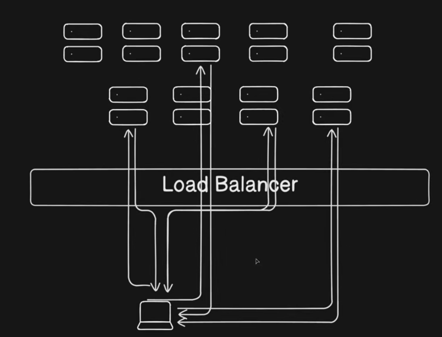

    - Polling scenario, if one server breaks down we don't need to worry

1. Short Polling
2. Long Polling

## Long Polling

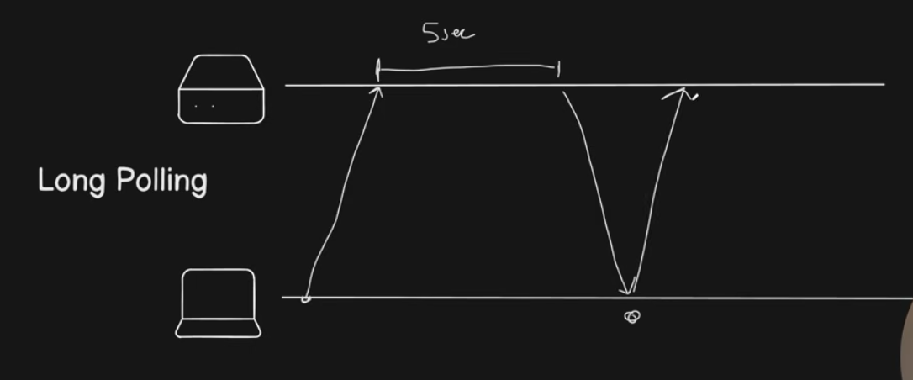
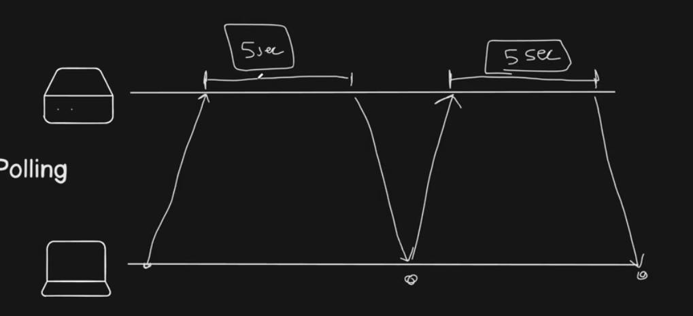
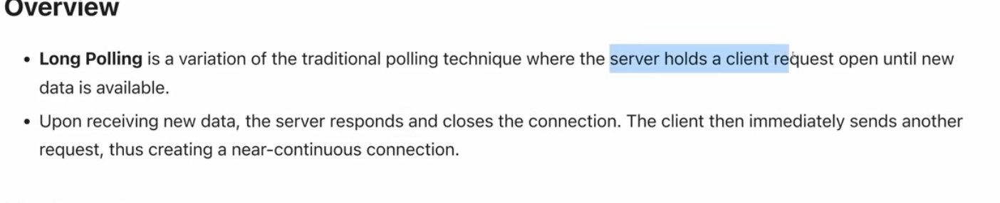

    - Let's say for a server there were 10,000 client connected to it and there are no Update for 5 mins, so the connections were opened and we can't close / utize them . biggest disadvantages.

## Short polling

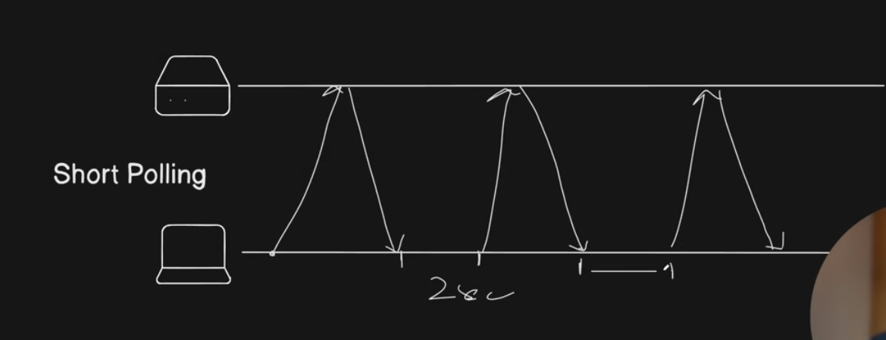
 client hold the waiting timing

 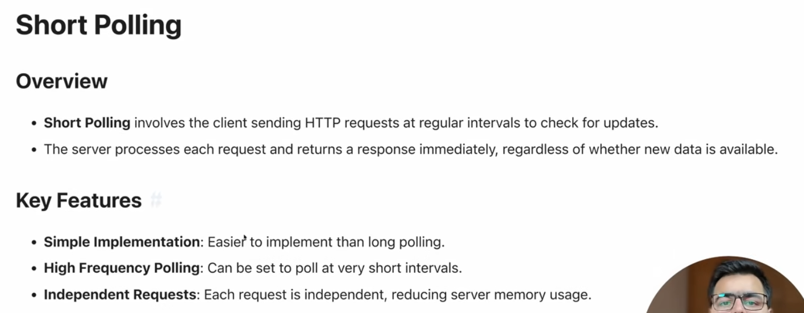

## SSE

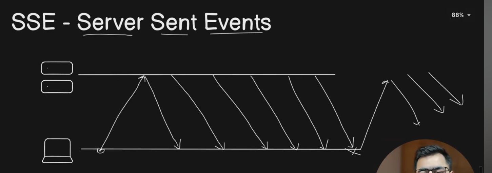
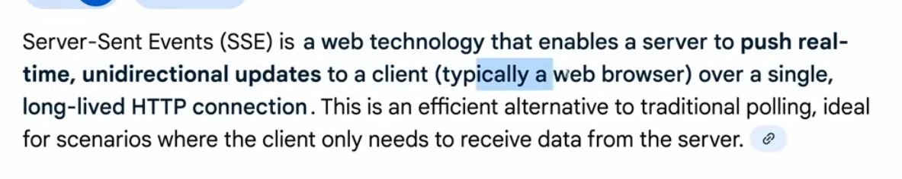

Reference:- https://www.youtube.com/watch?v=WS352jTTkPU
