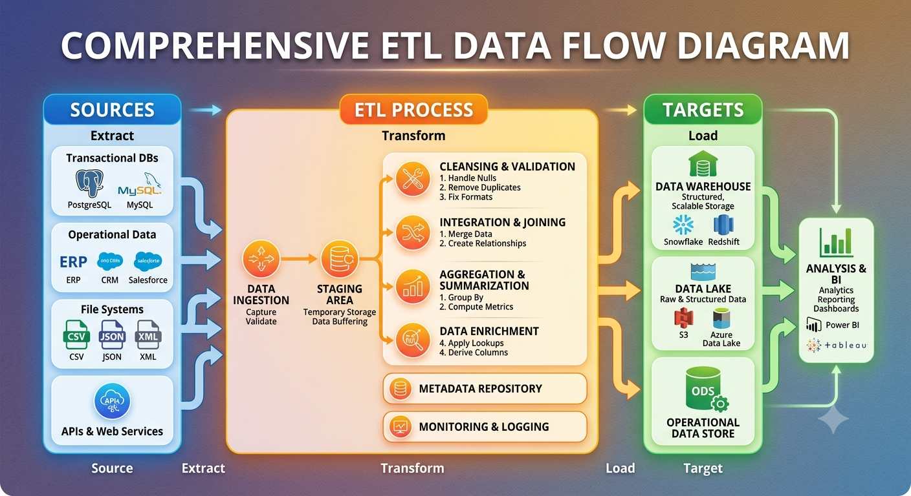

# Data-Intensive Applications

Store data safely and reliably so it is not lost.

Manage data by organizing, updating, and protecting it.

Access data quickly using indexes, caches, and efficient queries.

## Common Building Blocks of Distributed Systems

- **Database** — stores the main application data reliably.
- **Caching** — keeps frequently used data close to the application for faster reads.
- **Search index** — makes text and filtered searches fast.
- **Stream processing** — processes continuous event streams.
- **Batch processing (OLAP)** — processes large volumes of data for reporting and analytics.

## Stateless Backend + Serverless Backend Architecture

## Challenges with Databases

- Where should we keep the database — cloud, self-hosted, single region, or multiple regions?
- Which database should we choose?
	- SQL for structured relational data.
	- NoSQL for flexible schemas, scale, or special access patterns.
	- Distributed databases for high availability and scale.
- Key challenge: managing concurrency and consistency when many users update data at the same time.
- Access latency: indexes speed up reads but make writes slower because indexes must also be updated.
- Availability: the system should be accessible 24x7, even during failures or maintenance.

## OLTP vs OLAP

### OLTP (Online Transaction Processing)

- Reads and writes small records, such as one order or one payment, at a time.
- Low latency is critical because users expect immediate responses.

### OLAP (Online Analytical Processing)

- Processes large amounts of data across many records.
- Queries can take minutes or hours because the focus is analysis, not instant transactions.
- Use cases: historical data analysis, business reporting, data science, and machine learning.

## Data Warehouse & Data Lake

**ETL**: Extract, Transform, Load — collect data from different sources, clean/transform it, and load it into a data warehouse.

### ETL Flow

Data comes from many sources, for example SQL databases, NoSQL databases, CSV files, PDFs, spreadsheets, payment systems, and application logs.

ETL extracts data, cleans and transforms it, then loads structured data into a data warehouse for BI and analytics.

### Limitations of Data Warehouses

1. They are mainly meant for structured data.

For data science you often need many types of data that a data warehouse can't store easily, such as text, images, and video.

### Data Lake

To mitigate the limitations of data warehouses, the data lake concept was introduced.

- A centralized repository where we can store everything (structured and unstructured data).
- **Suchi Principle:** raw data is better.

Users of the data lake:

- Data scientists
- ML engineers
- Data engineers
- Researchers

## Cloud vs Self-Hosted

### Cloud Native

A system specifically designed for the cloud (for example, Snowflake, Google BigQuery). They can run in isolation but perform better and scale more easily in the cloud.

## Distributed Systems

### Why we need distributed systems

- Scalability
- Fault tolerance
- Lower latency — servers closer to users respond faster
- Elasticity — servers scale up and down based on traffic
- Legal compliance — data may need to remain in-country

### Problems / Challenges (Trade-offs)

- Network failures
- Increased complexity
- Consistency vs availability trade-offs
- Performance and latency concerns

### Popular Approach

- Microservice architecture — each service owns its data.
	- Example: `user` service has a user DB; `payment` service has a payment DB; `booking` service has a booking DB.