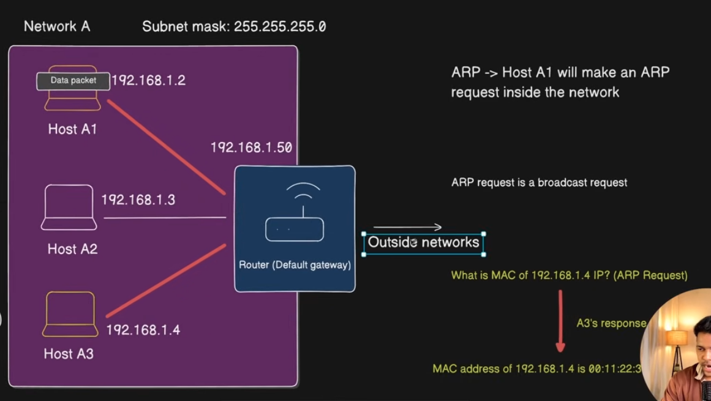
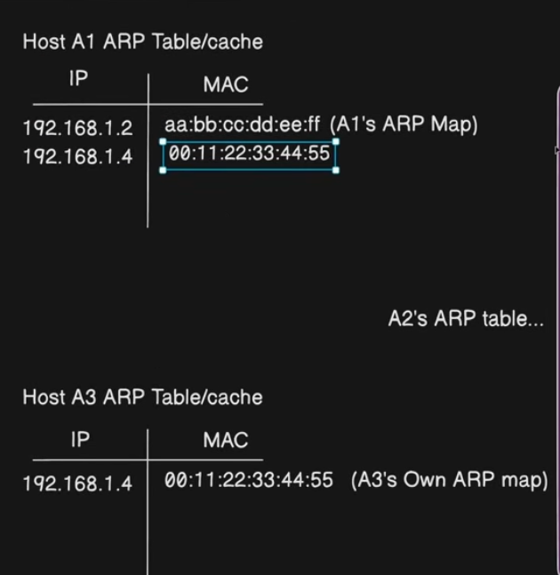
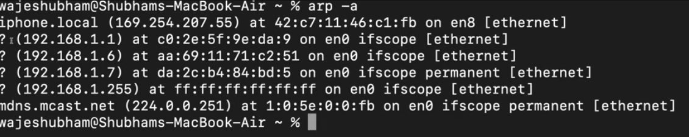

# ARP (Address Resolution Protocol)

Takes IP as input and returns the MAC address of the device that holding the IP address.

## If I wanted to send data Same Network

1. A1 will check if the A3 is in the same H+Network or we need HOP.
2. If let's say it is in the same Network (It will get to know after doing subnet masking)
3. for actual data transmit it need MAC address for that A1 will broadcast ARP request to all the hosts.
4. In reponse a host will only respond it it satisfy the request.

## If I wanted to send data out side of Network

1. I can't directly send the package, so it will send directly to default gateway (Router)
2. When A1 Broadcast ARP request then All the hosts will ignore and the default gateway will entertain this.
3. Then A1 wills end the packate to the Router (default gateway)

reference:-

- https://www.youtube.com/watch?v=kDAnEyg9nCg&list=PLd1s-PEC5Pio&index=11

