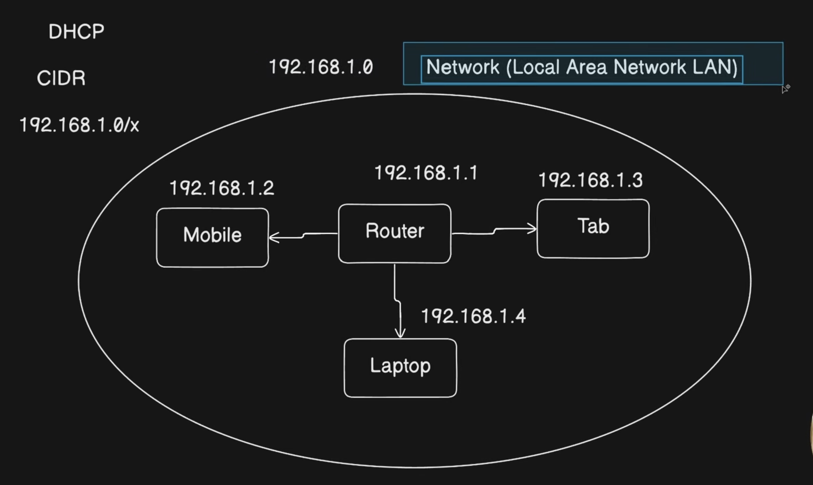
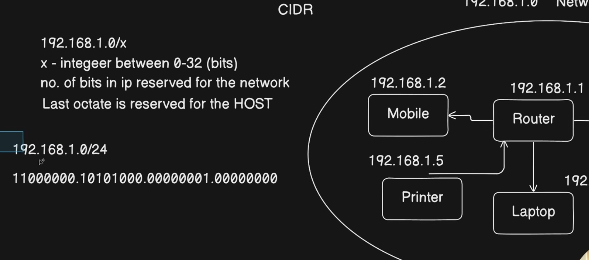

## Network + HOST + CIDR 

### CIDR Range

CIDR Quick Note

CIDR (Classless Inter-Domain Routing) defines how many bits of an IP address belong to the network.

Example:

192.168.1.0/24

/24 = 24 bits for Network
Remaining 32 - 24 = Last 8 bits for Hosts

Maximum usable hosts:

Hosts = 2^(32 - CIDR) - 2

(-2 because Network Address and Broadcast Address are reserved)

Examples:

/24 → 254 hosts
/25 → 126 hosts
/26 → 62 hosts
/27 → 30 hosts
/28 → 14 hosts

Easy Memory Trick:

Host bits = 32 - CIDR
Usable Hosts = 2^(Host bits) - 2

Example:

/27 → Host bits = 5
2^5 - 2 = 30 hosts

NOTE:- Network will have a IP address 

✅ In a LAN, CIDR tells you how many devices (hosts) can be assigned IP addresses in that network.

Reference:- https://www.youtube.com/watch?v=8QJ8k7jd-K0&list=PLd1s-PEC5Pio&index=5

