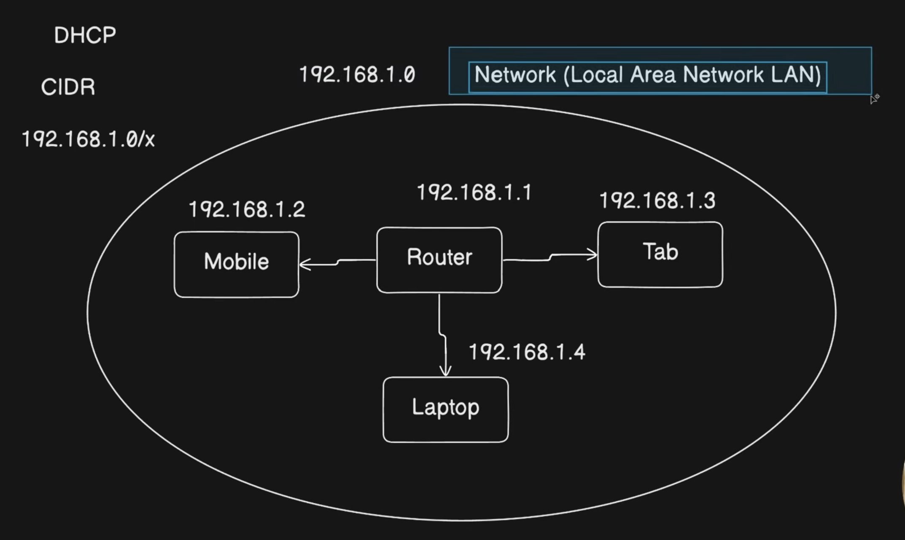
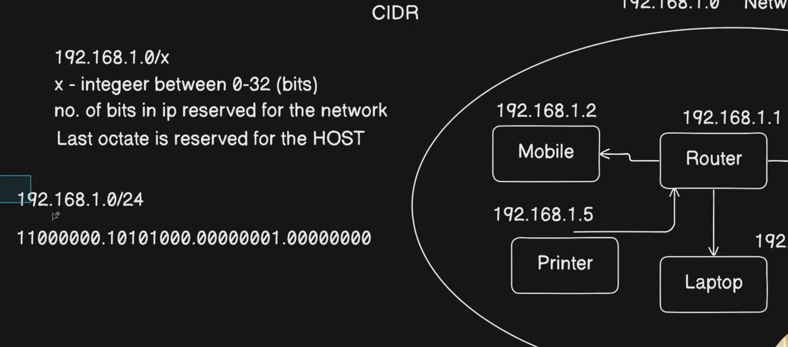

## Network + HOST + CIDR 

CIDR (Classless Inter-Domain Routing) defines how many bits of an IP address belong to the network.

### CIDR Range

1. 192.168.1.0/24
    - first 3 octates are reservered for my Network
    - last octate is for my host
        - and we can add (2^8-2)
2. 192.168.0.0/16
    - first 2 octates are reservered for my Network
    - Remaining 2 octates are for my host
        - and we can add max (2^16-2)

(-2 because Network Address and Broadcast Address are reserved)

Reference:- https://www.youtube.com/watch?v=8QJ8k7jd-K0&list=PLd1s-PEC5Pio&index=5

