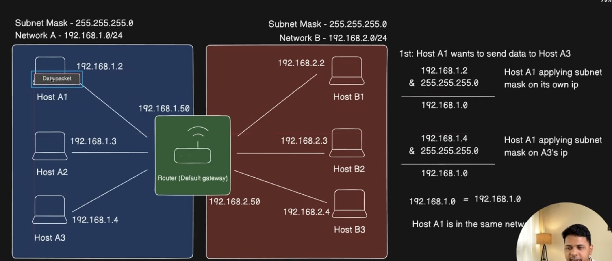
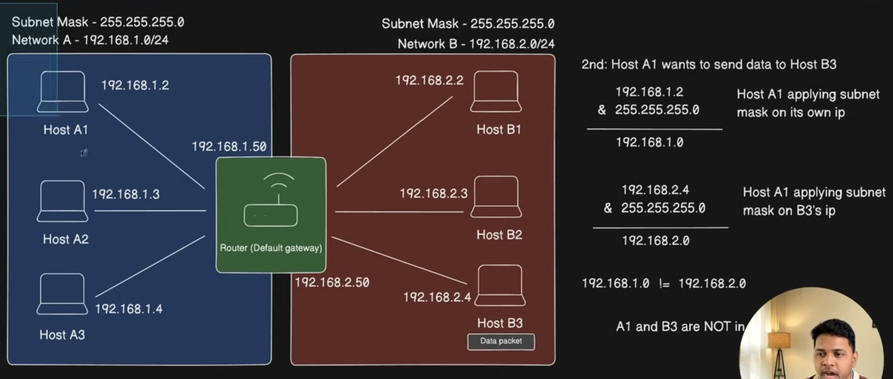

A **default gateway** is the IP address of the device your host sends traffic to when the destination is **not** on the local network (subnet). On a home setup, that is usually your router’s LAN IP (e.g. `192.168.1.1`).

## How the laptop “knows” it

The host does **not** invent the gateway. It learns it and stores it in its **routing table**.

Typical flow:

1. Laptop joins Wi‑Fi/Ethernet.
2. It gets config via **DHCP** from the router (or uses a static config you set).
3. DHCP includes: host IP, subnet mask, **default gateway**, DNS, etc.
4. The OS installs a route like:  
   `0.0.0.0/0 → via 192.168.1.1`  
   meaning “everything not local goes through this next hop.”

That gateway IP is kept in memory as part of the routing table (and sometimes persisted if you configured it statically).

## Where it lives

| How it’s set | Where it’s stored |
|---|---|
| DHCP (usual) | OS routing table while the lease is valid; renewed/updated on reconnect |
| Manual/static | OS network settings + routing table |
| Not “in ARP as the gateway IP” | ARP only maps IP ↔ MAC for local delivery |

So the laptop stores the gateway as a **route entry**, not as a special “gateway file” by itself.

## 07 How Default Gateways Facilitate Network Communication

### Data transfer with same Network

### Data transfer with different Network

- So here it is sending the data via default router to the other network.

Reference:- 
- https://www.youtube.com/watch?v=PqdrgoYb3Vc&list=PLd1s-PEC5Pio&index=7