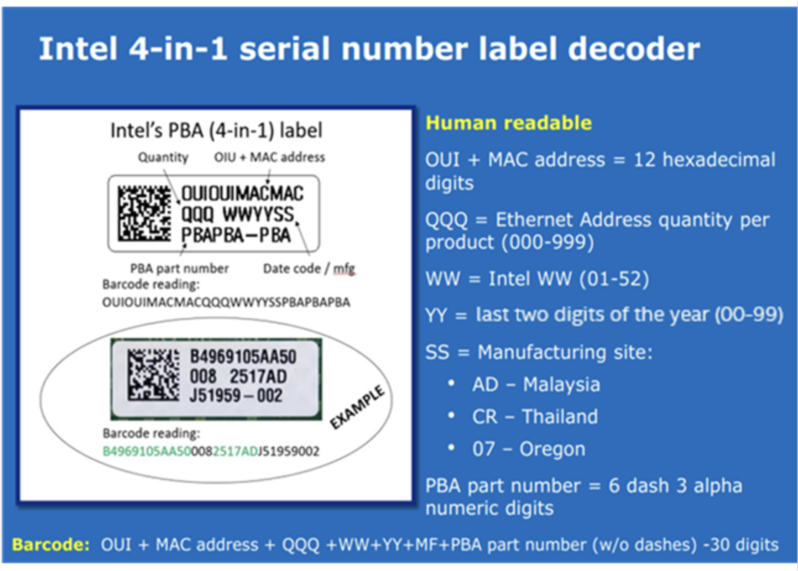
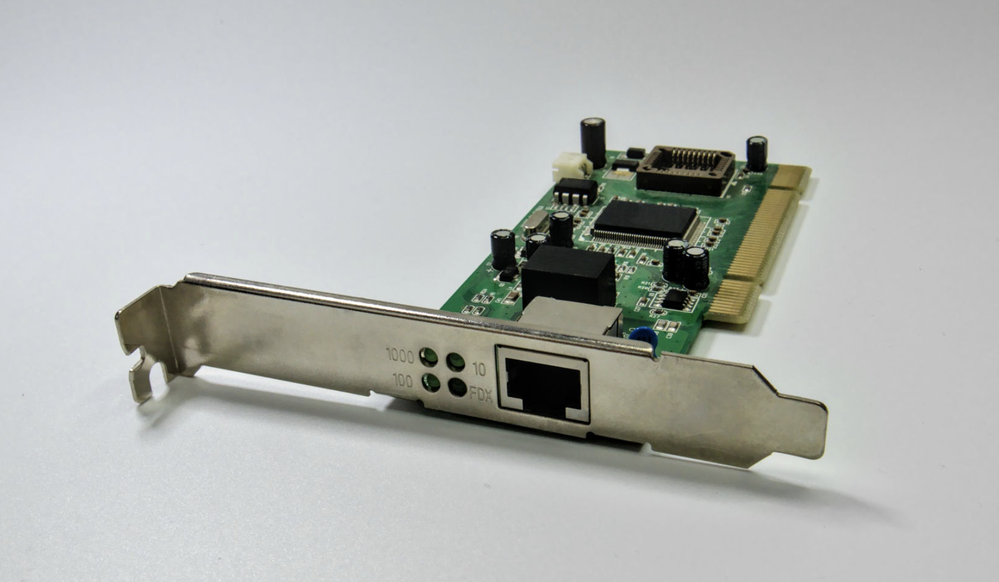

# 08 What is a MAC Address? Understanding Its Structure and Purpose

### 1. What is a MAC Address?

A **MAC address** (**Media Access Control address**) is a unique, physical identifier assigned to a **Network Interface Card (NIC)** by its manufacturer. Operating at **Layer 2 (Data Link Layer)** of the OSI model, it ensures that data packets sent over a local network (LAN) reach the exact hardware device intended.

---

### 2. How Many Bits is It?

A standard MAC address (MAC-48) is **48 bits** long.

* **Length in Bytes:** 6 bytes
* **Hexadecimal Characters:** 12 hexadecimal digits (each hex digit represents 4 bits)

---

### 3. Representation across Operating Systems

Although all operating systems read the same 48-bit address, they format the output differently:

| Operating System / Device | Notation Format | Example Representation | Command to View |
| --- | --- | --- | --- |
| **Windows** | Hyphen-separated pairs | `00-1A-2B-3C-4D-5E` | `ipconfig /all` or `getmac` |
| **Linux & macOS** | Colon-separated pairs | `00:1a:2b:3c:4d:5e` | `ifconfig` or `ip link` |
| **Cisco / Network Switches** | Period-separated quads | `001a.2b3c.4d5e` | `show interfaces` |

---

### 4. Two Parts of a MAC Address

A MAC address is split evenly into two 24-bit (3-byte) sections:

$$\underbrace{\text{00 : 1A : 2B}}_{\text{OUI (Vendor)}} \ : \ \underbrace{\text{3C : 4D : 5E}}_{\text{Host / NIC Identifier}}$$

1. **OUI (Organizationally Unique Identifier):**
* **First 24 bits** (3 bytes / 6 hex characters).
* Managed and assigned by the IEEE to hardware manufacturers (e.g., Intel, Apple, Cisco, Realtek) to identify who built the card.

2. **Host / Vendor-Assigned Identifier (NIC Extension):**
* **Last 24 bits** (3 bytes / 6 hex characters).
* Uniquely assigned by the manufacturer to each specific interface unit produced, ensuring no two network cards globally share the same MAC address.

---

### 5. Network Interface Card (NIC) Example

A Network Interface Card (NIC) is the physical hardware component inside a computer, laptop, or server that houses the network chip programmed with its unique MAC address.

## Why we need IP address if we can use MAC address and this is permanent ?

### 1. Why Do We Need an IP Address if We Have a MAC Address?

1. to reach to a destination Address or IP we need to hop from our laptop to default gateway (router) in this way with hops we can reach to destination Network.
    - We need to apply subnet masking to indentify if the target ip in the same network or in different network. If different then HOP.
2. Now to do actual Data transfer we need MAC address of that physical device.

Ex:- From my laptop to Ec2 instance

---

### 2. IP Address vs. MAC Address

| Feature | MAC Address | IP Address |
| --- | --- | --- |
| **Full Name** | Media Access Control Address | Internet Protocol Address |
| **Primary Purpose** | Local identification of hardware | Global routing and network address |
| **OSI Model Layer** | **Layer 2** (Data Link Layer) | **Layer 3** (Network Layer) |
| **Assignment** | Burned into hardware (NIC) by manufacturer | Assigned dynamically (via DHCP) or statically by admin |
| **Permanence** | **Permanent** (hardcoded to device) | **Temporary** (changes when you switch networks) |
| **Address Length** | **48 bits** (6 bytes) | **IPv4:** 32 bits / **IPv6:** 128 bits |
| **Format Example** | `00:1A:2B:3C:4D:5E` (Hexadecimal) | **IPv4:** `192.168.1.1` (Decimal) 

 **IPv6:** `2001:db8::1` (Hexadecimal) |
| **Scope of Traffic** | Local Network (LAN) only; dropped by routers | Global Internet (WAN) and Local Network (LAN) |
Reference:-

- https://www.youtube.com/watch?v=jKWlJPpkp9o&list=PLd1s-PEC5Pio&index=8
- https://www.youtube.com/watch?v=sMDYh-II22Q&list=PLd1s-PEC5Pio&index=9

