# OSI Model

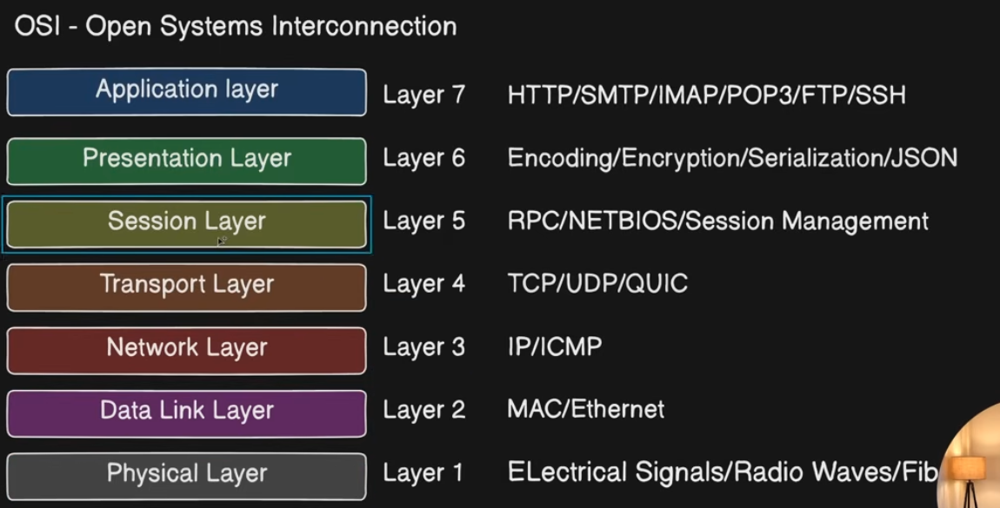

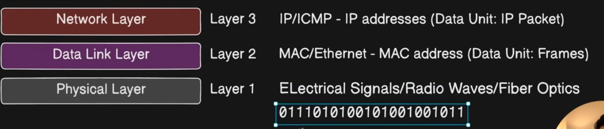

## TCP/IP Model

in today real world scenarios in our application we manage 

1. OSI's applicaiton layer + encription + any library to do the job + session management + authorization + Authntication so TCP/IP model combile top 3 to Application layer which is good.

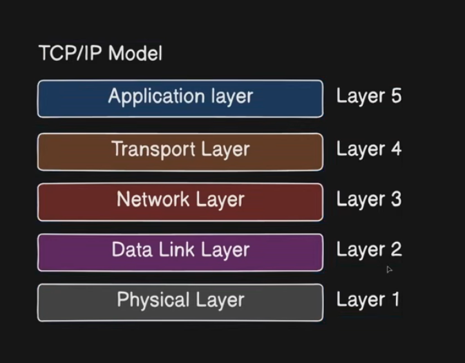

TCP IP Application Layer:-

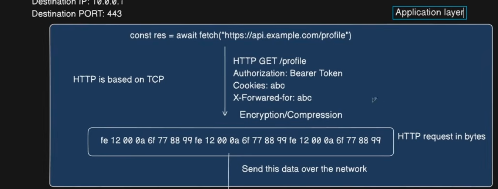
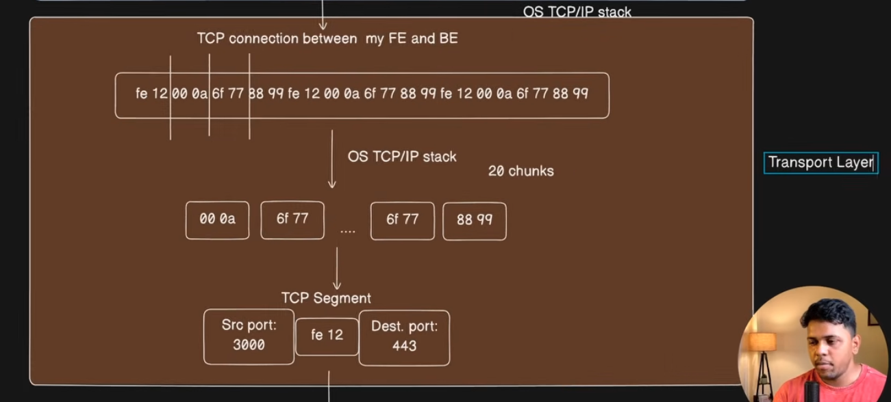 
TCP Segment 
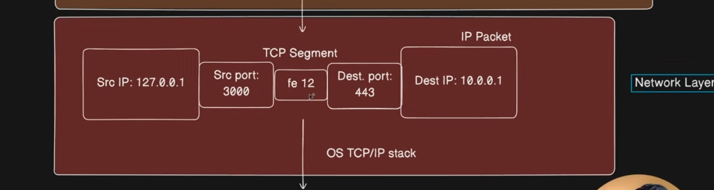
 IP Packet so Network layer
 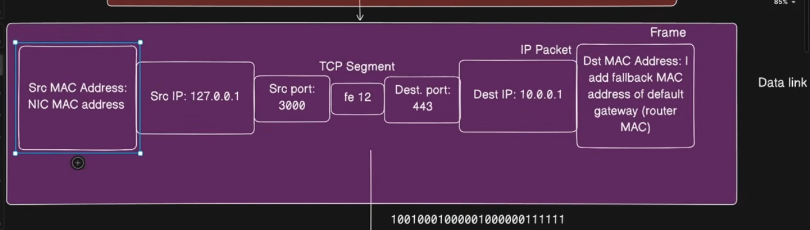
 Data Link Layer
 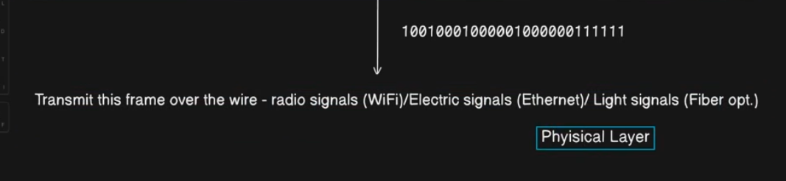
 Physical Layer

 # Source to Destination:--

 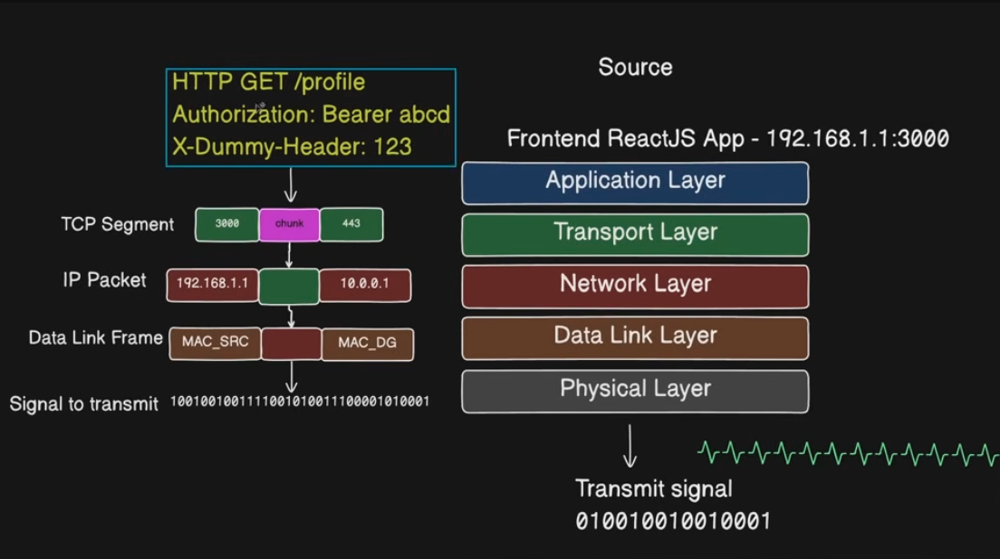
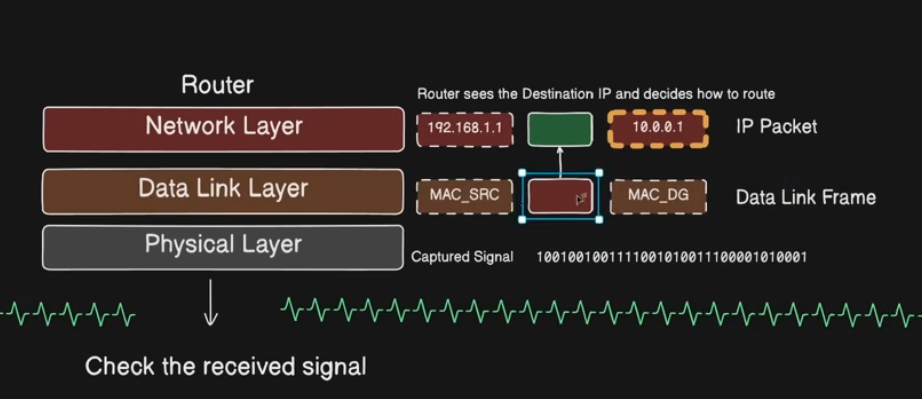
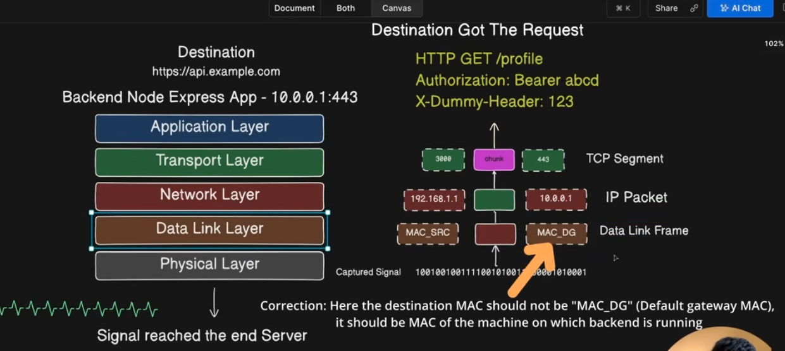

After Back end has the response it will to the same from Back end to fron-end 

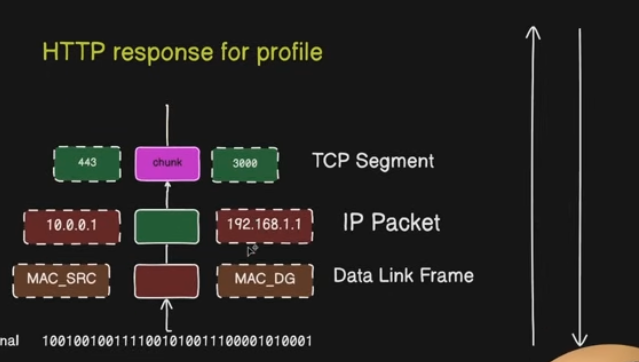

Reference:-

https://www.youtube.com/watch?v=ZOLkWBVMcwU&list=PLd1s-PEC5Pio&index=11

