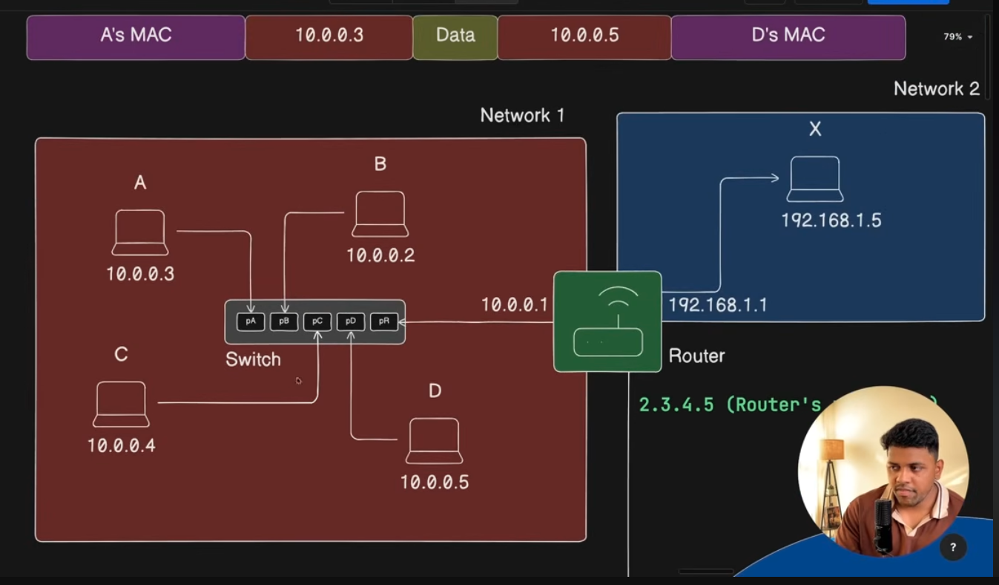
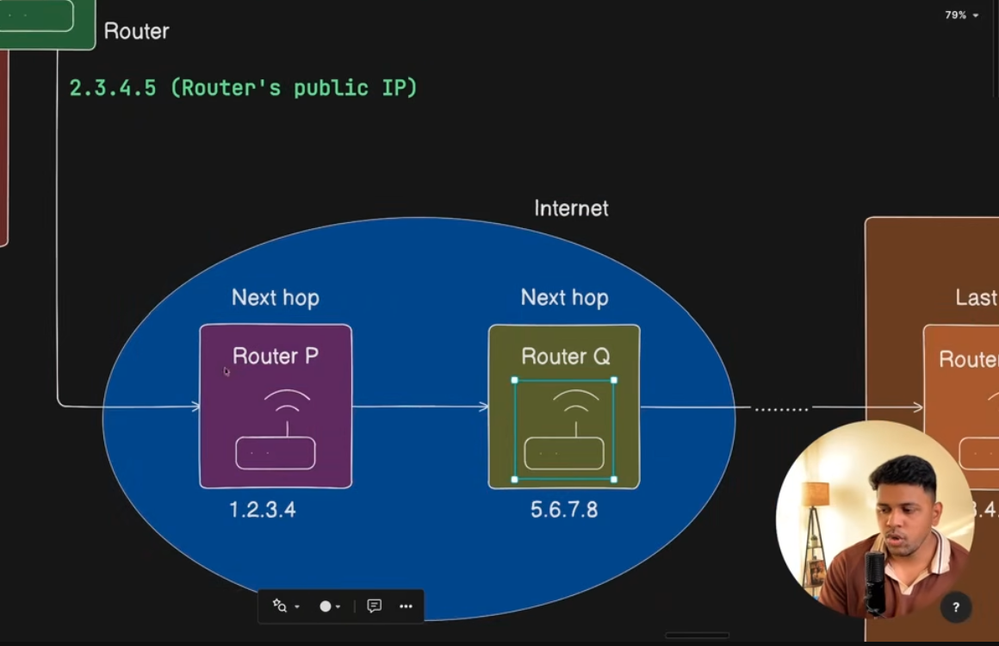
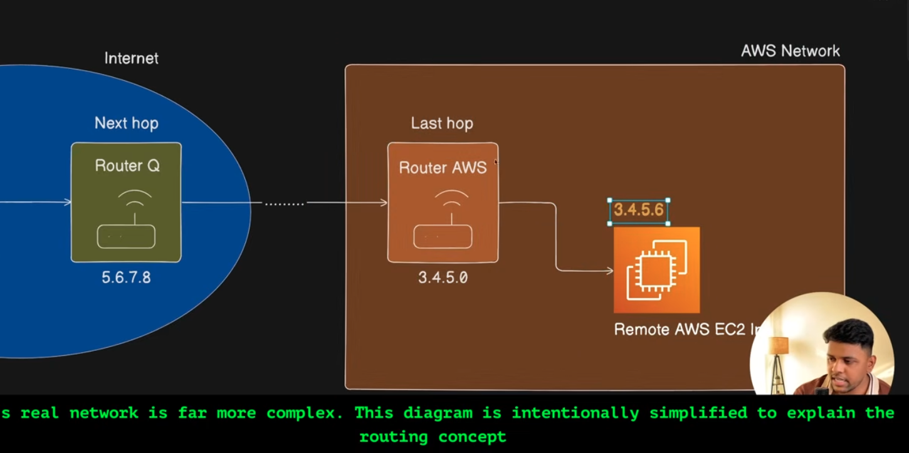

Switch:- will check the mac address to send the data last 2 layer. It only route the traffic.

Switch vs Router:

-- Till this Point it is sufficient for the developer------

Reference:-
https://www.youtube.com/watch?v=GBhaNXK-ows&list=PLd1s-PEC5Pio&index=12

