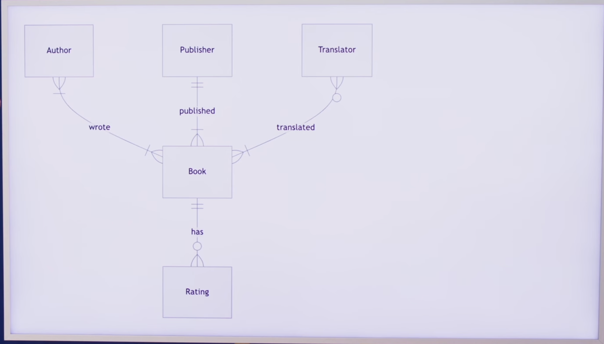
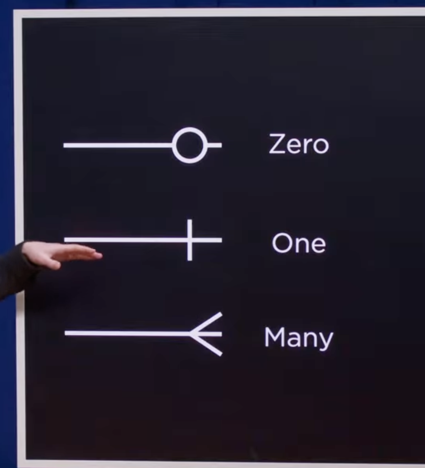
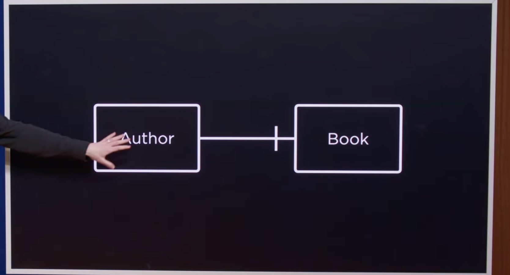
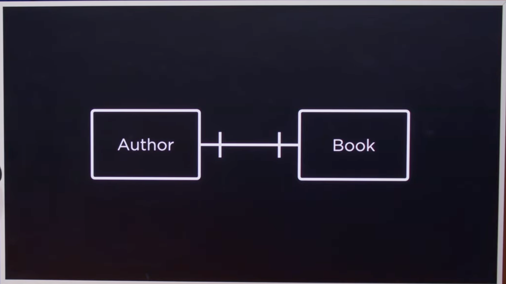
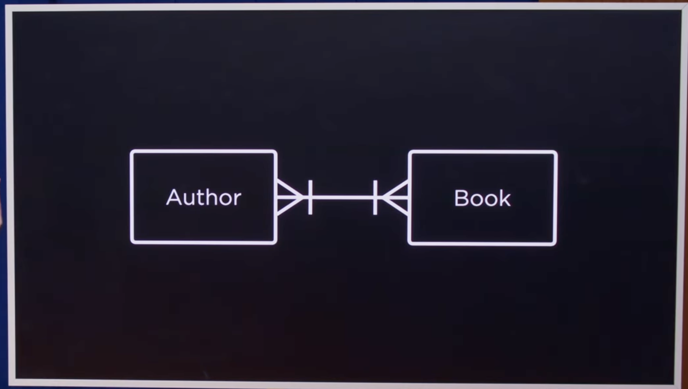

## Entity Relation Diagram

## One

    - We need to study left to right 
    - Author wrote 1 book

    
    - Right to Left, A book has at least 1 Auther

    - Auther to Book 
        - Author can write at least one or Many books
    - Book to Auther
        - A Book can  have at least 1 or more authores

## Translater to BOOK

- Book to Translator
    - A Book can be translated by 0 or Many translator
- Translater to Book
    - A Translator can  Translate at least 1 or many books.

## Book To Rating

- Book to rating
    - A book can have 0 or many ratings
- Rating to BOOK
    - Each rating to 1 and only books
