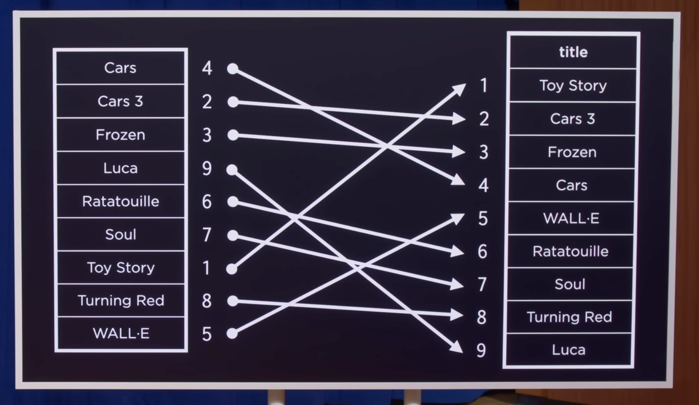
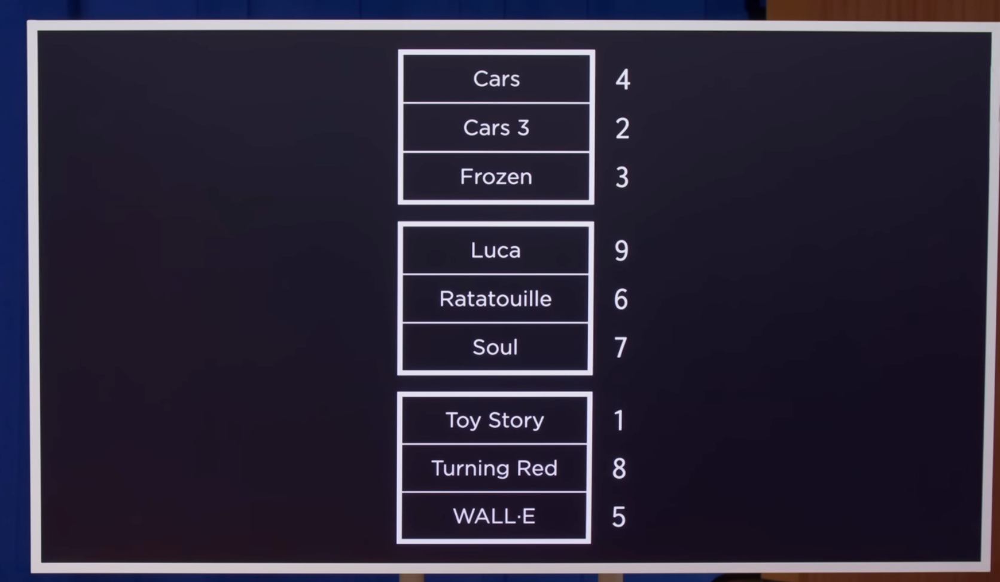
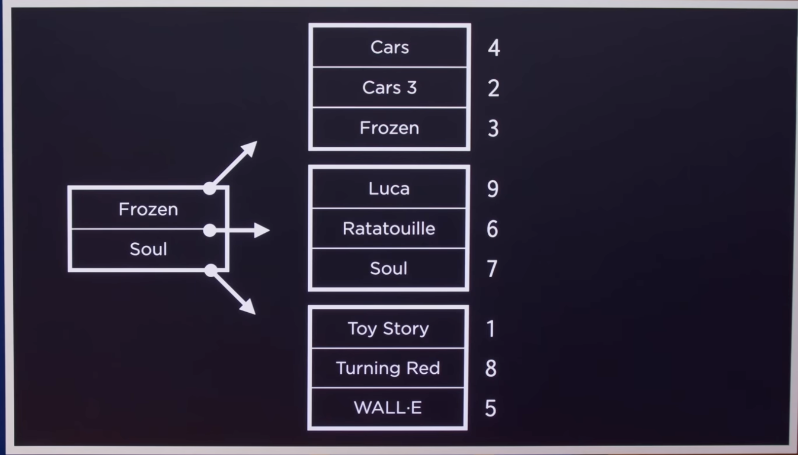
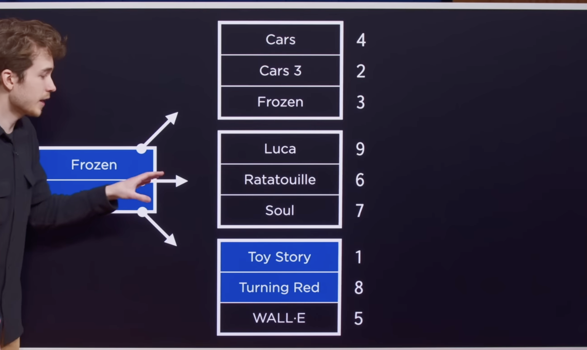
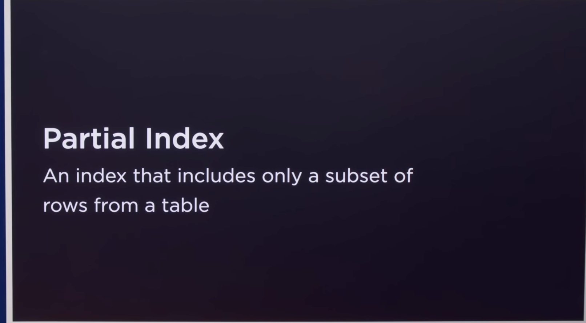
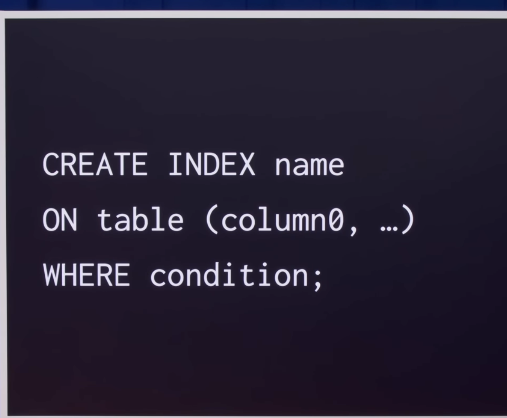

## How indexing works under the hood

    - left (index)
    - right (Table) 
- we can't just store all the title index in the RAM because it would be very heavy.
- So we can store with Nodes, (B-Tree)

    - Row number

## Limitation:-

1. Space
2. insert new row is expensive

## Partial Index

