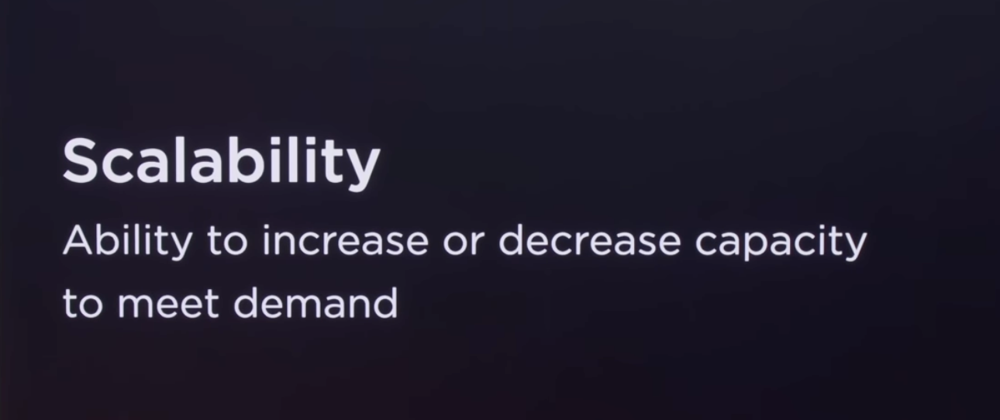
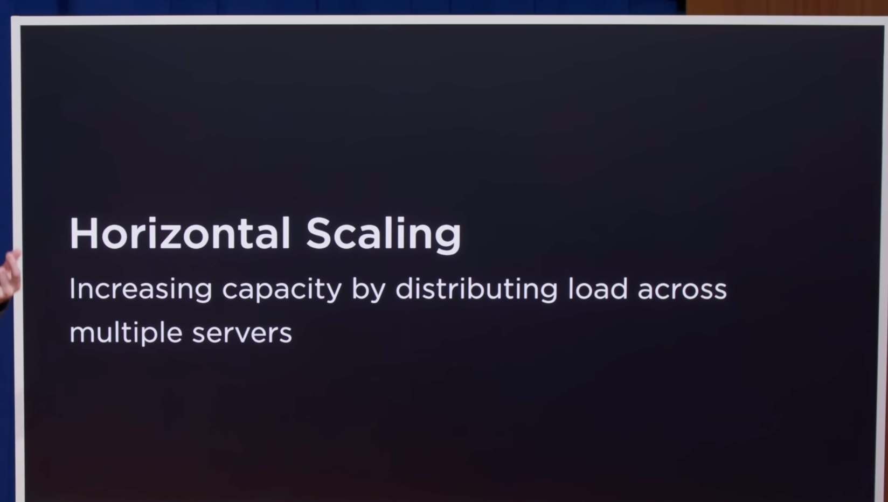
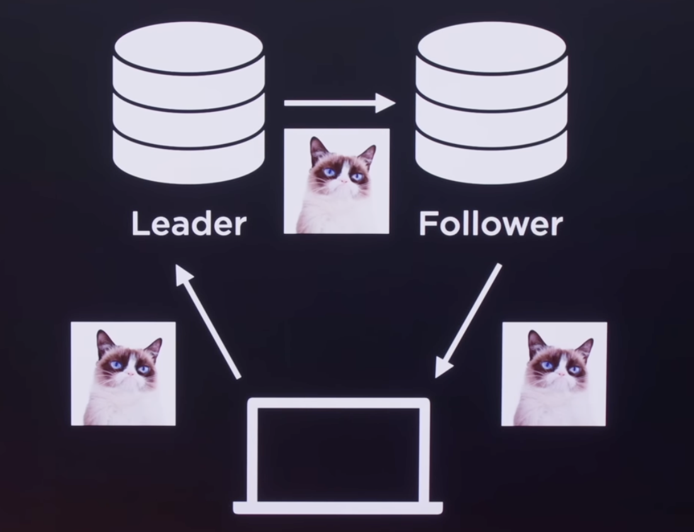
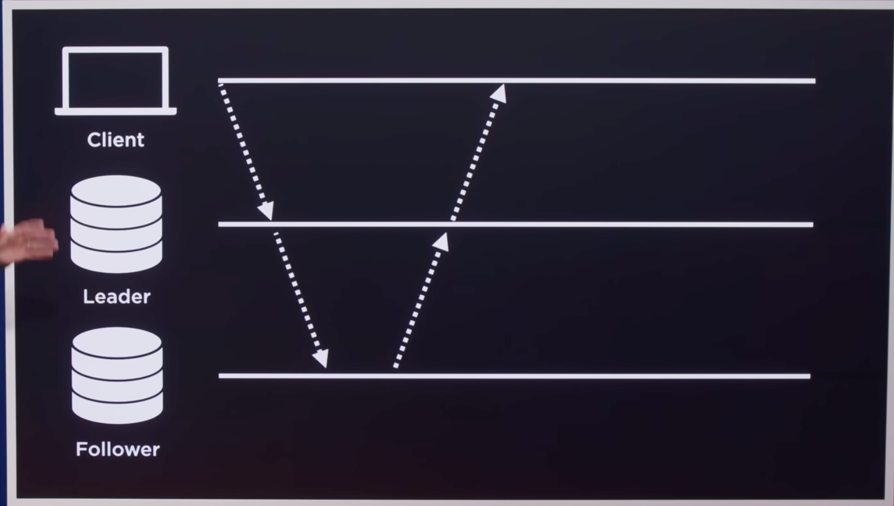
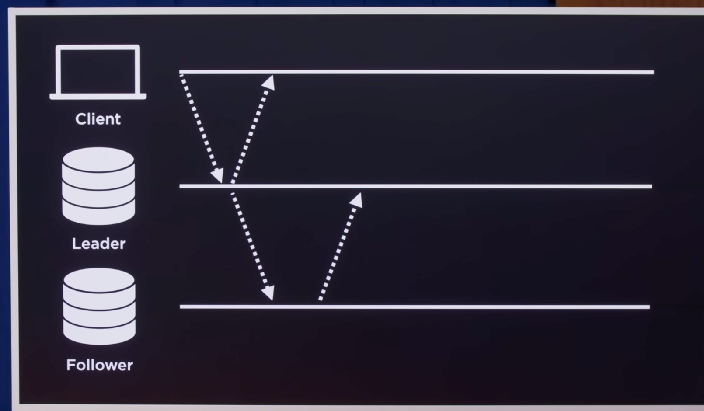

    - If I have single server, so horizontal scaling needed.
    -  

## Replication

    - keeping copies of a database on multiple server.

    types:-
        - Single Lead
        - Multi Lead
        - Leader Less

Single Lead:-

### Read Replica(Follower)
    - A Copy of a database from which data may only be read.

### Leader
    - We only going to send write requests there.

NOTE:- when we have multiple Leaders for write I believe we need to have some load balancer / when we have multiple follower I belive there also we need a load balancer to distribute the loads. But need more investigation on the same.

Communication between Leader and followers:-

    - Sync
    - Async

### SYNC 

### ASYNC

-- We need to decide based on trade offs which could be best fit for the situation

