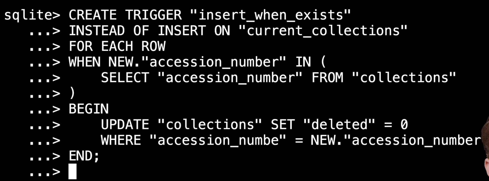
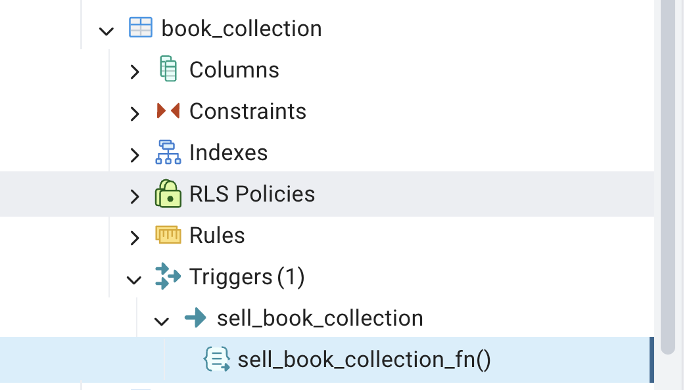

# Triggers


**SQL triggers** are stored procedures that run automatically when a specified event happens on a table (or view): `INSERT`, `UPDATE`, or `DELETE`.


## Conditional Triggers:-




## What they do

- Enforce rules that are hard to express with constraints alone
- Audit changes (who/when/what)
- Keep related tables in sync
- Block or adjust invalid modifications

## Timing

| Timing | When it runs |
|--------|----------------|
| `BEFORE` | Before the row change is applied |
| `AFTER` | After the row change is applied |
| `INSTEAD OF` | Replaces the action (mainly on views) |

## Row vs statement

- **Row-level** (`FOR EACH ROW`): runs once per affected row
- **Statement-level** (`FOR EACH STATEMENT`): runs once per SQL statement

---

## Generic syntax (PostgreSQL-style)

```sql
CREATE TRIGGER trigger_name
{ BEFORE | AFTER | INSTEAD OF }
{ INSERT | UPDATE | DELETE | TRUNCATE }
[ OF column_name [, ...] ]   -- optional, for UPDATE
ON table_name
[ REFERENCING { OLD | NEW } TABLE AS alias ]  -- statement-level (PG)
[ FOR EACH { ROW | STATEMENT } ]
[ WHEN (condition) ]
EXECUTE FUNCTION function_name();
```

PostgreSQL usually uses a function:

```sql
CREATE OR REPLACE FUNCTION audit_employee_changes()
RETURNS TRIGGER AS $$
BEGIN
  INSERT INTO employee_audit(emp_id, action, changed_at)
  VALUES (NEW.id, TG_OP, NOW());
  RETURN NEW;  -- BEFORE/AFTER INSERT/UPDATE: return NEW
               -- DELETE: often RETURN OLD
END;
$$ LANGUAGE plpgsql;

CREATE TRIGGER trg_employee_audit
AFTER INSERT OR UPDATE OR DELETE ON employees
FOR EACH ROW
EXECUTE FUNCTION audit_employee_changes();
```


## `NEW` / `OLD` (row-level)

| Event | `OLD` | `NEW` |
|-------|-------|-------|
| `INSERT` | — | new row |
| `UPDATE` | before | after |
| `DELETE` | deleted row | — |

---

## Useful management commands

```sql
-- Drop
DROP TRIGGER IF EXISTS trigger_name ON table_name;  -- PostgreSQL
DROP TRIGGER IF EXISTS trigger_name;               -- MySQL

-- Disable / enable (examples)
ALTER TABLE table_name DISABLE TRIGGER trigger_name;  -- PostgreSQL
ALTER TABLE table_name ENABLE TRIGGER trigger_name;
```

  
