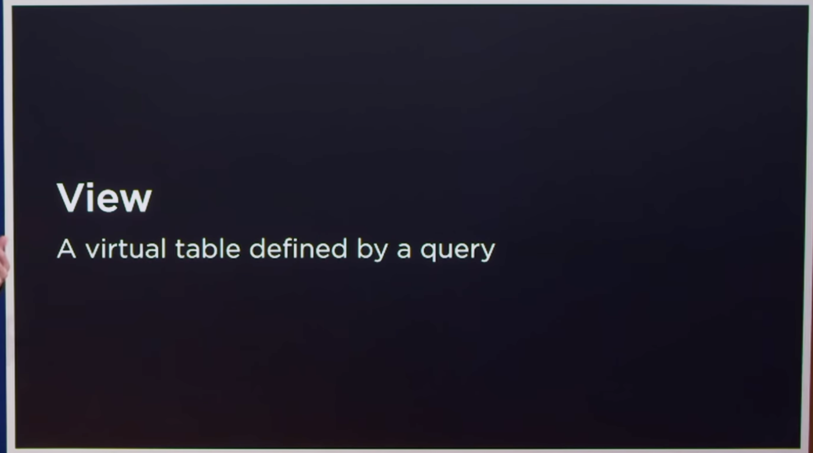
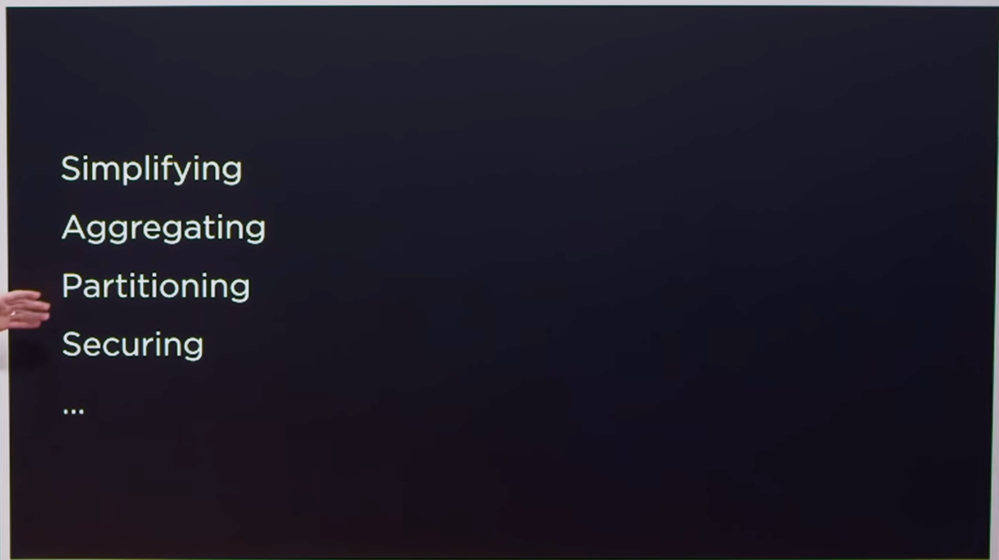
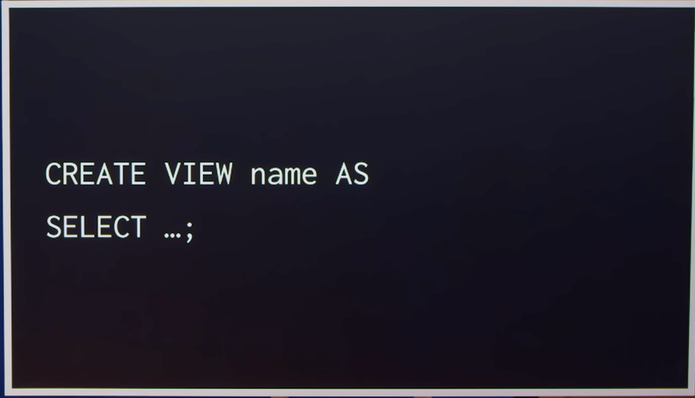
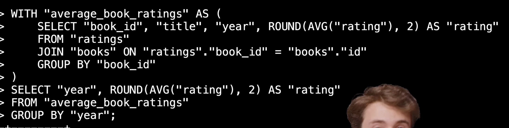

    - example we can have joins and / or few queries to see the view

## Why to use views

## Temporary View

    - It will present till we have DB connection open when we close it will be cleaned .
    - We can create a view from a view let's say for shorter or longer period.

## CTE (Common Table Expression)

    - Very temporary view only for a Query,