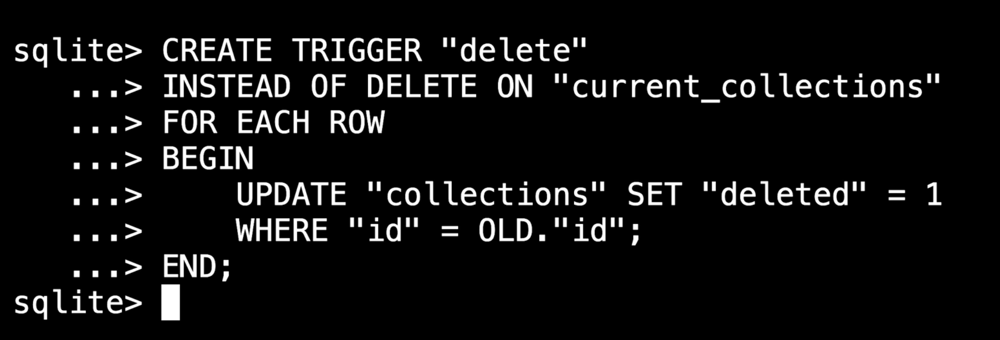
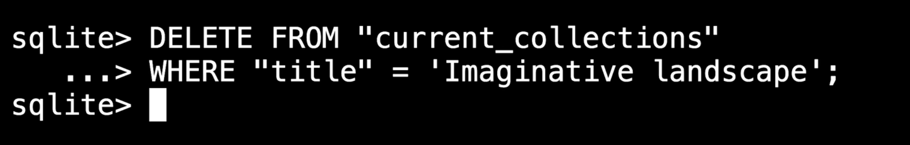

    - example we can have joins and / or few queries to see the view

## Why to use views

## Temporary View

    - It will present till we have DB connection open when we close it will be cleaned .
    - We can create a view from a view let's say for shorter or longer period.

## CTE (Common Table Expression)

    Very temporary view only for a Query,

-- With the views we can have

	-- Security

		-- we will not show all the columns here.
		-- What ever we need only going to show and make anonomyse the rows
		-- Also we can grant Rolls / Access control to a user to only see the view not the table.

	-- Partitioning

		-- With this we can handle millions of recorded table to partion it with logical ways

	-- Soft Deletion

NOTE:- 
-- We can't directly modify the view, but we can set a trigger to do the same.

	-- we will add trigger to the view but in trigger function we will update the actual table

    Here the current_collection is the view.

    Now it will work, but earlier we can't do any operation on views

## Conditional Triggers

