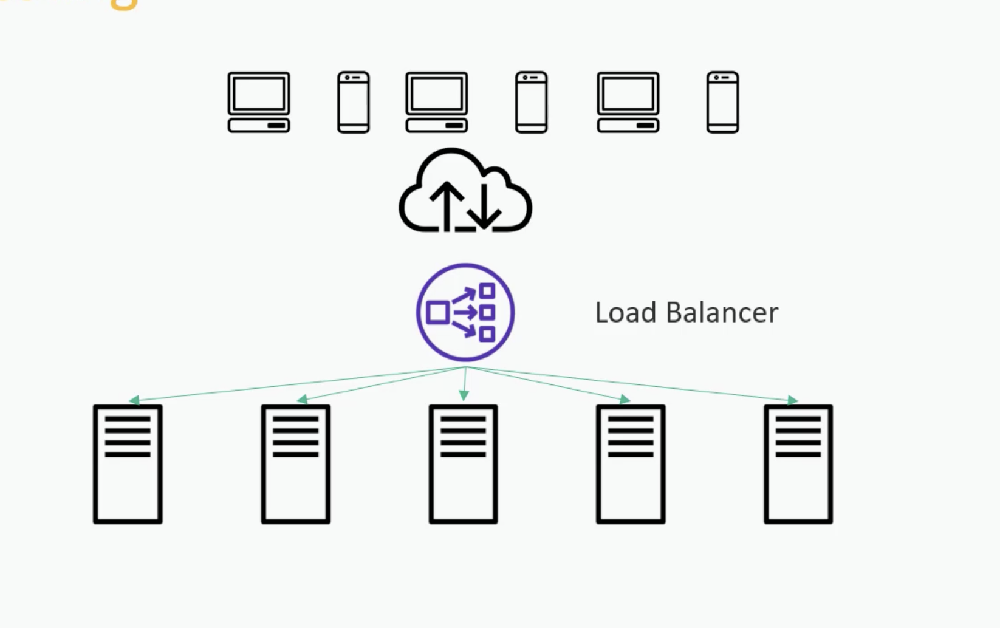

**Vertical scaling** (scale up) means making one machine stronger: more CPU, RAM, disk, or a bigger instance type.  
**Horizontal scaling** (scale out) means adding more machines and spreading the load across them.

---

### Vertical scaling

| Advantages | Disadvantages |
|---|---|
| Simple — no distributed-system redesign | Hard ceiling — one box can only get so big |
| App often needs little or no change | Downtime or brief disruption when resizing |
| Easier debugging (single process/host) | Single point of failure |
| Lower ops complexity at small scale | Cost grows steeply at the high end |
| Shared memory / local state stays easy | Can’t scale past hardware limits |

**Best when:** traffic is moderate, the app isn’t designed for distribution, or you need a quick capacity bump.

---

### Horizontal scaling

| Advantages | Disadvantages |
|---|---|
| Near-unlimited capacity in theory | More complex: load balancing, networking, coordination |
| Better fault tolerance (one node can die) | App must be (mostly) stateless or share state carefully |
| Can scale with demand (add/remove nodes) | Consistency, caching, and session issues get harder |
| Often cheaper at large scale (commodity nodes) | Harder to debug and operate |
| Rolling deploys / zero-downtime upgrades | Data stores need sharding/replication design |

**Best when:** you expect growth, need high availability, or already run behind a load balancer / in containers/Kubernetes.

---

### Quick mental model

```
Vertical:   [ App ]  →  [ Bigger App ]
Horizontal: [ App ]  →  [ App ] [ App ] [ App ]  (+ load balancer)
```

In practice most systems do **both**: vertical for databases or hot path services that are hard to split, horizontal for web/API workers that are easy to replicate.



## **Yes **— once you split data across services (or shards), **consistency becomes a design problem**, not something the database handles for you automatically.

### Why it happens in microservices

In a monolith, one DB + one transaction can keep everything consistent:

```
OrderService + InventoryService + PaymentService
        ↓
   [ One database ]
   BEGIN … COMMIT
```

In microservices, each service usually owns its own DB:

```
Order Service → Order DB
Inventory Service → Inventory DB
Payment Service → Payment DB
```

There is **no single ACID transaction** across those databases. So you can get:

| Problem | Example |
|---|---|
| Partial success | Order created, payment fails → orphan order |
| Stale reads | Inventory says “in stock”, another service already reserved it |
| Dual writes diverge | Order marked paid, payment record never written |
| Eventual inconsistency | Service A updated, Service B sees old data for a while |

That is the trade-off: **scalability and team independence** vs **harder consistency**.

---

### How teams handle it

1. **Database per service**  
   Don’t share one schema across services. Avoids tight coupling, but forces cross-service coordination.

2. **Eventual consistency (most common)**  
   Accept “eventually correct,” not “instantly correct everywhere.”  
   Example: place order → publish `OrderCreated` → Inventory and Payment react.

3. **Saga pattern**  
   Multi-step workflow with **compensating actions** if a later step fails.  
   Example: payment fails → cancel order / release stock.

4. **Outbox / reliable messaging**  
   Write business data + “event to publish” in the **same** local DB transaction, then publish the event. Avoids “DB updated but message lost.”

5. **Idempotency**  
   Same event/message processed twice must not double-charge or double-reserve.

6. **Read models / CQRS (when needed)**  
   Separate write path from query path; queries may be slightly behind but fast and scalable.

---

### Scaling vs splitting (related but different)

| Approach | What you split | Main worry |
|---|---|---|
| Vertical DB scale | Bigger machine | Cost, ceiling, downtime |
| Horizontal DB scale (replicas) | Read copies | Replica lag (stale reads) |
| Sharding | Rows across nodes | Cross-shard queries/joins |
| Microservices DBs | Data by **domain/service** | Distributed consistency, sagas |

So: **horizontal scaling of one DB** ≠ **one DB per microservice**. Both can cause inconsistency, but microservice split is usually about **domain ownership and deployment independence**, not only load.

---

### Practical rule of thumb

- Keep data that must be **strongly consistent together** in the **same service/DB**.
- Across services, design for **eventual consistency + clear failure recovery** (saga/compensation).
- Prefer **APIs/events** over shared tables.
