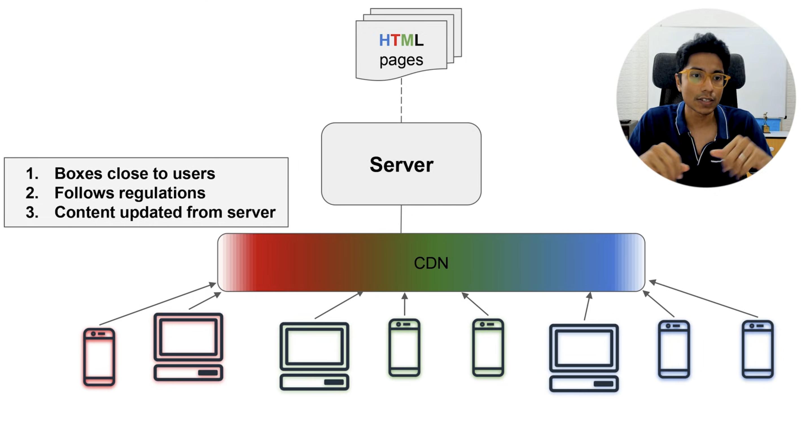

## CDN (Content Delivery networks)



Example:- AWS Cloud front

mostly for Image / videos 

we can linked wit S3 buckets and all.

**S3** stores the files. **CDN** delivers them fast to users. You usually use both.

## Roles

| | **S3 (object storage)** | **CDN (CloudFront, Fastly, etc.)** |
|---|---|---|
| Job | Persist objects | Cache & serve from edge locations near users |
| Best for | Source of truth, uploads, archives | Low latency, high traffic, global scale |
| Alone? | Slow for global users; origin bandwidth costs | Needs an origin (often S3) |

**Rule of thumb:** Put static/media in S3 → put a CDN in front for public reads.

---

## When S3 alone is enough

- Internal backups, logs, data lakes  
- Low traffic / single region  
- Private objects via pre-signed URLs (no public CDN needed)  
- Batch processing inputs/outputs  

## When CDN is required

- Public, cacheable files with many readers  
- Global users / mobile  
- Large media (video, high-res images)  
- Spiky traffic (sales, launches, popular titles)  
- You want to hide/protect the origin and cut egress cost  

## Practical combo

```
Users → CDN (edge cache) → S3 (origin)
                ↘ API / app (dynamic)
```

- **E-comm:** S3 + CDN for images/static; API for cart/checkout.  
- **Netflix-like:** S3 (or equivalent) for storage + encoding pipeline; CDN for almost all playback bytes.

**Short answer:** S3 = where content lives; CDN = how users get it quickly at scale. E-comm needs both for storefront assets; content-heavy video *must* use CDN in front of object storage.